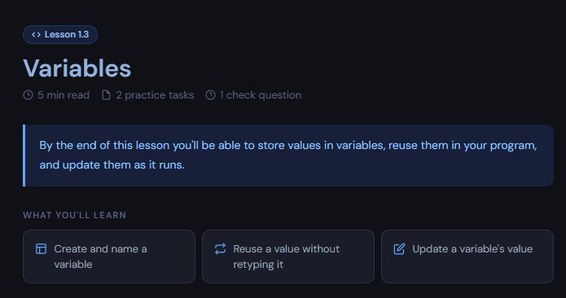

# Python Examples

An interactive Python learning course for beginners, all in your browser. No downloads, no paywalls. Its broken into small units with the basic fundamental skills, with tons of lessons including code examples, lesson goals, mini quizzes, practice problems, and projects. Basically everything you need to finally learn Python!!!

## Live Demo

Try it here: [https://dagavedant.github.io/Python-Examples/](https://dagavedant.github.io/Python-Examples/)

The first two lessons are totally free, no account needed. You can read them, run real Python right in the browser, and take the quiz. When your ready to keep going, make a free account to unlock the rest, save your progress across devices, and get AI feedback on your practice code.

## Quick Peak



Theres also a short demo video at `public/video/demo.mp4` if you want to see it in action.

## What You Get

- 27 lessons across 7 units, from your very first program all the way to 2D lists
- A built in code editor with line wrapping and AI feedback on your practice code
- Progress that saves across all your devices once you sign in
- A quiz and two practice tasks in every lesson

## How does it Work

Its a static site (just HTML, CSS, and JS) with a [Supabase](https://supabase.com) backend doing the heavy lifting:

- Accounts and your lesson progress live in Supabase, so your progress follows you everywhere.
- Your practice code gets checked by a Supabase function that uses AI. The API key stays on the server, so its never exposed in the browser.
- Each lesson loads all its content from a `data.js` file inside `Unit X/lesson Y/`. The `lesson.html` page reads the `?unit=` and `?lesson=` from the URL and renders the right lesson automatically.

## Running it Locally

Since its all static, you can serve the folder with pretty much anything:

```bash
python -m http.server 8000
```

Then open `http://localhost:8000` in your browser.

You dont even need Python installed to follow the lessons in the browser, but if you want to run the practice code in your own editor you'll need Python 3.x. I love VS Code, but any IDE works perfect.

## The Course

### Unit 1 - Getting Started with Python
> Creating your first Python program and learning the basic blocks of every program

| # | Lesson | Project |
|---|--------|---------|
| 1.1 | Your First Program | About Me Card |
| 1.2 | Output & Formatting | Receipt Printer |
| 1.3 | Variables | Scoreboard |
| 1.4 | Input | Greeting Card |
| 1.5 | Data Types & Casting | Tip Calculator |

### Unit 2 - Number Calculations & Data
> Learn how to do math in Python and make programs that calculate real values

| # | Lesson | Project |
|---|--------|---------|
| 2.1 | Arithmetic Operators | Area Calculator |
| 2.2 | Integer vs Float Division | Bill Splitter |
| 2.3 | Numbers from Input | Shopping Calculator |
| 2.4 | Math Library Basics | Triangle Solver |

### Unit 3 - Making Decisions
> Make programs that choose between different paths

| # | Lesson | Project |
|---|--------|---------|
| 3.1 | Comparisons & Booleans | Number Checker |
| 3.2 | if / else | Odd or Even |
| 3.3 | elif & Multiple Branches | BMI Calculator |
| 3.4 | Combining Conditions (and / or / not) | Theme Park Entry |

### Unit 4 - Repetition & Loops
> Learn to repeat code blocks automatically, instead of copying the code over and over again

| # | Lesson | Project |
|---|--------|---------|
| 4.1 | for Loops | Times Table Printer |
| 4.2 | range() in Depth | FizzBuzz |
| 4.3 | while Loops | Number Guessing Game |
| 4.4 | Loops & Decisions | Word Filter |

### Unit 5 - Functions
> Organise code into reusable code blocks

| # | Lesson | Project |
|---|--------|---------|
| 5.1 | Defining & Calling Functions | Recipe Card |
| 5.2 | Arguments & Parameters | Personalised Greeting Card |
| 5.3 | Return Values | Mini Calculator |
| 5.4 | Designing with Functions | Student Report Card |

### Unit 6 - Lists
> Store many different data values together

| # | Lesson | Project |
|---|--------|---------|
| 6.1 | Creating & Indexing Lists | Top 5 List |
| 6.2 | Adding & Removing Items | To-Do List App |
| 6.3 | Looping Through Lists | Class Gradebook |
| 6.4 | Useful List Methods | Leaderboard |

### Unit 7 - 2D Lists
> Work with grids and tables

| # | Lesson | Project |
|---|--------|---------|
| 7.1 | Lists Inside Lists | Noughts & Crosses Board |
| 7.2 | Accessing Rows & Columns | Seating Plan Editor |
| 7.3 | Looping Over a Grid | Tic-Tac-Toe Game |

## Totals

- 7 units
- 27 lessons
- 27 projects (one per lesson)
- 27 quizzes (one per lesson)
- 54 practice tasks (two per lesson)

## Credits

Its built by Vedant Daga [https://github.com/DagaVedant](https://github.com/DagaVedant)

Also using different fonts from [Google Fonts](https://fonts.google.com)

I have used AI to help with coding (mainly supabase setup) and other integrations, but most of the design was done by me like Figma design for website and I made all the questions and information on the lessons
